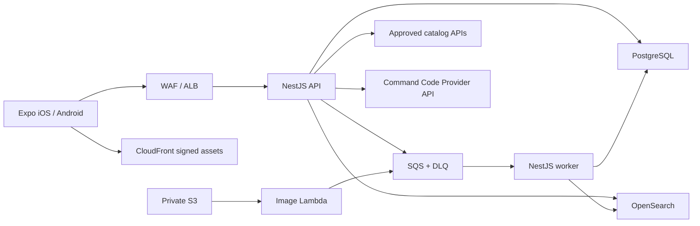

# Shopport

한국 쇼핑몰의 승인된 상품 API를 대화에서 비교하는 iOS·Android 쇼핑 에이전트입니다. 이 저장소는 통합 실행 환경, GraphQL 계약, E2E, 출시 BOM과 공통 문서를 관리합니다.

## 무엇을 만드는가

Shopport는 카카오 로그인 후 대화로 상품을 찾고 비교할 수 있는 모바일 앱입니다. 상품 검색은 승인된 provider 계약 안에서만 동작하며, 인증·대화·이미지·찜·기록은 앱과 백엔드가 함께 관리합니다.

## 핵심 경험

| 영역        | 제공 범위                                                          |
| ----------- | ------------------------------------------------------------------ |
| 대화형 탐색 | 대화에서 상품을 찾고 결과를 비교합니다.                            |
| 이미지 처리 | 업로드 이미지를 정규화한 뒤 비동기 처리합니다.                     |
| 개인화      | 대화 기록, 찜, 입력 초안을 기기와 서버의 역할에 맞게 보관합니다.   |
| 안전한 연동 | 승인된 catalog API와 ZDR 경로를 지원하는 AI provider만 사용합니다. |

승인 문서, credential, 보존·이미지 권한이 확인되지 않은 provider는 등록하거나 production UI에 노출하지 않습니다.

## 모바일 UX 설계

AI 쇼핑 에이전트의 탐색 과정을 사용자가 이해하고 제어할 수 있도록 대화와 상품 경험을 하나의 흐름으로 설계했습니다. 구현 의도와 화면별 근거는 [모바일 UX 설계 Wiki](https://github.com/cyjoon68/shopport-app/wiki/UX-Design)에서 확인할 수 있습니다.

### 1. Quick Action으로 첫 질문 시작

빈 대화·빈 입력 상태에 가로형 Quick Action을 배치하여 입력창 중심으로 첫 질문을 시작할 수 있도록 구성

<p align="center">
  
</p>

### 2. AI 탐색 중 실행 제어

AI 탐색 중에도 실행을 중지할 수 있고, 취소·실패 후에는 같은 질문으로 다시 탐색하거나 질문을 수정해 이어갈 수 있도록 설계

<p align="center">
  
</p>

### 3. 대화와 상품 결과 전환

채팅·상품 Segmented Control과 화면 상태 보존을 적용하여 요청 내용과 상품 결과를 자유롭게 오갈 수 있도록 설계

<p align="center">
  
</p>

### 4. 작업 맥락을 유지하는 Drawer

Drawer를 overlay navigation으로 구성하여 swipe 종료 후에도 현재 탭과 작업 맥락을 유지

<p align="center">
  
</p>

## 구성



모바일은 Expo Router 기반이고, 백엔드는 API·worker·image Lambda로 나뉜 modular monolith입니다. 전체 구성과 런타임 계약은 [아키텍처 문서](docs/architecture.md)에서 확인할 수 있습니다.

## 빠른 시작

Node.js 22.13 이상, Corepack, Docker가 필요합니다.

```bash
git submodule update --init --recursive
corepack enable
cp shopport-infra/.env.example shopport-infra/.env
cp shopport-be/.env.example shopport-be/.env
cp shopport-fe/.env.example shopport-fe/.env
make dev-core
```

`make dev-core`는 PostgreSQL, LocalStack, migration, API와 worker를 실행합니다. OpenSearch까지 포함하려면 `make dev`를 사용합니다.

모바일 앱은 별도 터미널에서 실행합니다.

```bash
pnpm --dir shopport-fe install --frozen-lockfile
pnpm --dir shopport-fe start
```

계약 검사와 종료는 루트에서 실행합니다.

```bash
make contract
make down
```

AI provider와 Kakao identity credential이 준비된 경우에만 통합 E2E를 실행할 수 있습니다. 자세한 절차는 [테스트·출시 게이트](docs/release-gates.md)를 참고하세요.

## 저장소 구성

| 경로                                       | 역할                                     |
| ------------------------------------------ | ---------------------------------------- |
| [shopport-fe](shopport-fe/README.md)       | Expo 모바일 앱, 공통 UI·토큰, EAS 설정   |
| [shopport-be](shopport-be/README.md)       | NestJS GraphQL API, worker, image Lambda |
| [shopport-infra](shopport-infra/README.md) | Terraform, Helm, Argo CD, 관측 설정      |

세 경로는 Git submodule입니다. 루트 커밋과 태그는 호환이 검증된 세 SHA를 고정하는 출시 BOM입니다.

## 상세 문서

- [아키텍처](docs/architecture.md)
- [개발·CI/CD](docs/development.md)
- [Provider 승인 정책](docs/providers.md)
- [AI provider](docs/ai-provider.md)
- [개인정보·데이터 수명주기](docs/privacy-lifecycle.md)
- [운영 runbook](docs/runbooks.md)
- [테스트·출시 게이트](docs/release-gates.md)

## 라이선스

이 저장소는 공개 열람용입니다. 별도 결정 전에는 OSS 라이선스를 부여하지 않습니다.
