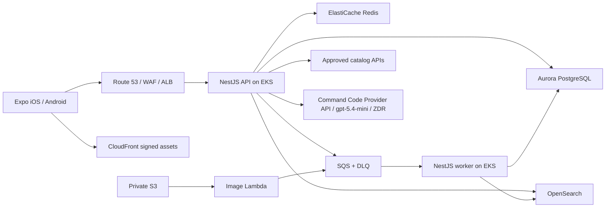

# 아키텍처

GraphQL이 조회·일반 mutation 계약을 담당하고 `/v1/ai/chat`은 TanStack AI NDJSON stream을 담당합니다. 별도 BFF는 없습니다. `threadId`는 conversation ID, `runId`는 idempotency key입니다. Redis durability log는 1시간 보관됩니다.

백엔드는 modular monolith이며 배포 단위만 API, worker, image Lambda로 나뉩니다. 모바일은 `expo-router/drawer` 루트와 중첩 native Stack을 사용합니다. 768px 미만은 front Drawer, 이상은 permanent Drawer입니다.

지원 기준은 iOS 16.4+, Android 7(API 24)+, 휴대폰·태블릿입니다. 한국어·KRW만 지원합니다.
